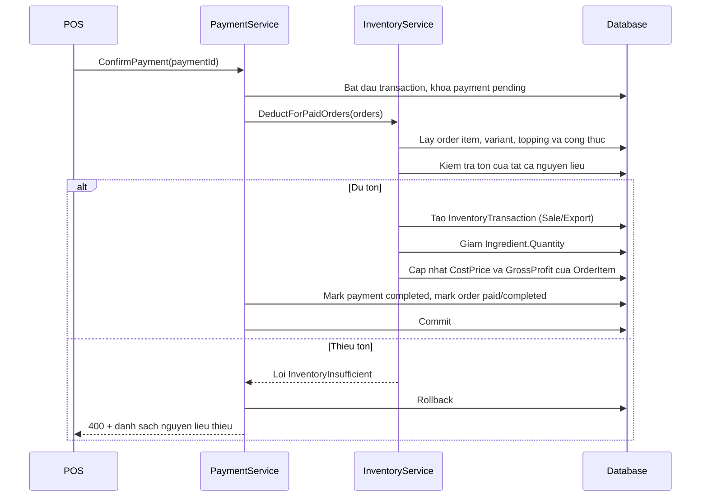

# Inventory API contract cho FE

## 1. Quy ước chung

- Base path: /api/inventory
- Tất cả endpoint yêu cầu Bearer JWT.
- JSON dùng camelCase.
- Response thành công luôn có wrapper:

~~~
{
  "succeeded": true,
  "message": "Thông báo",
  "errors": [],
  "data": {}
}
~~~

- 401: chưa đăng nhập hoặc token không hợp lệ.
- 403: không có quyền truy cập theo cơ chế auth hiện tại.
- 400: dữ liệu không hợp lệ, tồn thực tế âm, hao hụt vượt tồn, hoặc cấu hình item không thuộc store.
- 404: ingredient/product không tồn tại trong store.
- Decimal gửi bằng JSON number, không gửi chuỗi định dạng tiền.
- DateTime trả ISO-8601 UTC.

## 2. Enum

| Field | Giá trị | Ý nghĩa |
| --- | --- | --- |
| type | Import = 1 | Nhập/tăng tồn |
| type | Export = 2 | Xuất/giảm tồn |
| reason | Purchase = 1 | Nhập hàng |
| reason | Sale = 2 | Bán hàng tự động |
| reason | Waste = 3 | Hao hụt/hư hỏng |
| reason | StocktakeIncrease = 4 | Kiểm kê tăng |
| reason | StocktakeDecrease = 5 | Kiểm kê giảm |
| inventoryDeductionMode | RecipeOnly = 1 | Chỉ trừ nguyên liệu |
| inventoryDeductionMode | ProductOnly = 2 | Chỉ trừ thành phẩm |
| inventoryDeductionMode | Both = 3 | Trừ cả thành phẩm và nguyên liệu |

Inventory API nhận/trả enum dưới dạng string. FE gửi Import, ManualIssue, Ingredient, Product, Draft, Completed, TransferOut theo đúng tên enum. Backend vẫn đọc số enum cũ để tương thích tạm thời, nhưng không dùng số trong code FE mới.

## 3. Ingredient inventory

### 3.1 Danh sách nguyên liệu

GET /api/inventory/ingredients?storeId={storeId}&status={all|low|out}

Status optional, mặc định all.

Response data là mảng:

~~~
[
  {
    "id": 10,
    "storeId": 1,
    "name": "Trà ô long",
    "unit": "g",
    "quantity": 850,
    "minimumStock": 1000,
    "averageUnitCost": 120,
    "lastImportUnitCost": 125,
    "isTrackInventory": true,
    "isLowStock": true,
    "isOutOfStock": false
  }
]
~~~

### 3.2 Nhập nguyên liệu

POST /api/inventory/imports

~~~
{
  "storeId": 1,
  "ingredientId": 10,
  "quantity": 5000,
  "unitCost": 125,
  "vendorId": 3,
  "note": "Nhập buổi sáng"
}
~~~

Response data:

~~~
{
  "ingredient": { "id": 10, "quantity": 5850, "averageUnitCost": 124.27 },
  "movement": {
    "id": 501,
    "ingredientId": 10,
    "productId": null,
    "type": "Import",
    "reason": "Purchase",
    "quantity": 5000,
    "requestedQuantity": 5000,
    "shortageQuantity": 0,
    "unitCost": 125,
    "totalCost": 625000,
    "orderId": null,
    "orderItemId": null,
    "note": "Nhập buổi sáng",
    "occurredAt": "2026-06-22T10:00:00Z"
  }
}
~~~

Ingredient trong response luôn có đủ các field ở endpoint danh sách; ví dụ trên chỉ rút gọn.

### 3.3 Điều chỉnh tồn nguyên liệu

POST /api/inventory/adjustments

~~~
{
  "storeId": 1,
  "ingredientId": 10,
  "actualQuantity": 4700,
  "reason": "Kiểm kê cuối ca",
  "note": "Cân lại thực tế"
}
~~~

ActualQuantity là tồn cuối cùng FE đếm được, không phải số chênh lệch. Backend tự tạo Import hoặc Export movement.

### 3.4 Hao hụt nguyên liệu

POST /api/inventory/wastage

~~~
{
  "storeId": 1,
  "ingredientId": 10,
  "quantity": 100,
  "reason": "Hết hạn",
  "note": null
}
~~~

Quantity phải lớn hơn 0 và không được vượt tồn hiện có.

### 3.5 Cấu hình nguyên liệu

PUT /api/inventory/ingredients/{ingredientId}/settings

~~~
{
  "minimumStock": 1000,
  "isTrackInventory": true
}
~~~

Response data là InventoryIngredientResponse.

### 3.6 Lịch sử nguyên liệu

GET /api/inventory/ingredients/{ingredientId}/movements?from={ISO-UTC}&to={ISO-UTC}

Response data là InventoryMovementResponse[]. Với movement nguyên liệu, ingredientId có giá trị và productId là null.

## 4. Product/finished-product inventory

### 4.1 Danh sách thành phẩm

GET /api/inventory/products?storeId={storeId}&status={all|low|out}

Response data:

~~~
[
  {
    "id": 20,
    "storeId": 1,
    "name": "Coca Cola lon",
    "quantity": 23,
    "minimumStock": 6,
    "averageUnitCost": 12000,
    "lastImportUnitCost": 12000,
    "isTrackInventory": true,
    "inventoryDeductionMode": "ProductOnly",
    "isLowStock": false,
    "isOutOfStock": false
  }
]
~~~

### 4.2 Nhập thành phẩm

POST /api/inventory/product-imports

~~~
{
  "storeId": 1,
  "productId": 20,
  "quantity": 24,
  "unitCost": 12000,
  "note": "Nhập một thùng"
}
~~~

Response data:

~~~
{
  "product": { "id": 20, "quantity": 24, "inventoryDeductionMode": "ProductOnly" },
  "movement": {
    "id": 601,
    "ingredientId": null,
    "productId": 20,
    "type": "Import",
    "reason": "Purchase",
    "quantity": 24,
    "requestedQuantity": 24,
    "shortageQuantity": 0,
    "unitCost": 12000,
    "totalCost": 288000,
    "orderId": null,
    "orderItemId": null,
    "note": "Nhập một thùng",
    "occurredAt": "2026-06-22T10:00:00Z"
  }
}
~~~

### 4.3 Điều chỉnh và hao hụt thành phẩm

POST /api/inventory/product-adjustments

~~~
{
  "storeId": 1,
  "productId": 20,
  "actualQuantity": 22,
  "reason": "Kiểm kê cuối ca",
  "note": null
}
~~~

POST /api/inventory/product-wastage

~~~
{
  "storeId": 1,
  "productId": 20,
  "quantity": 1,
  "reason": "Móp lon",
  "note": null
}
~~~

### 4.4 Cấu hình cách trừ thành phẩm

PUT /api/inventory/products/{productId}/inventory-settings

~~~
{
  "minimumStock": 6,
  "isTrackInventory": true,
  "inventoryDeductionMode": "ProductOnly"
}
~~~

Chọn mode:

- RecipeOnly: dùng cho món pha chế; chỉ trừ ingredient theo recipe.
- ProductOnly: dùng cho chai/lon/snack; mỗi OrderItem trừ một Product.
- Both: trừ một Product và toàn bộ ingredient recipe.

### 4.5 Lịch sử thành phẩm

GET /api/inventory/products/{productId}/movements?from={ISO-UTC}&to={ISO-UTC}

Với movement thành phẩm, productId có giá trị và ingredientId là null.

## 5. Recipe API

### 5.1 Replace toàn bộ recipe món

PUT /api/inventory/products/{productId}/recipe

~~~
[
  { "ingredientId": 10, "quantity": 15 },
  { "ingredientId": 11, "quantity": 40 }
]
~~~

Response data là null. Đây là replace-all: luôn gửi toàn bộ recipe còn hiệu lực.

### 5.2 Replace adjustment theo variant

PUT /api/inventory/product-variants/{variantId}/recipe-adjustments

~~~
[
  { "ingredientId": 10, "quantityDelta": 5 },
  { "ingredientId": 11, "quantityDelta": -10 }
]
~~~

QuantityDelta là chênh lệch so với recipe món. Response data là null.

### 5.3 Replace recipe topping

PUT /api/inventory/toppings/{toppingId}/recipe

~~~
[
  { "ingredientId": 22, "quantity": 50 }
]
~~~

Quantity là định lượng của một topping. Response data là null.

Đọc recipe gốc hiện dùng GET /api/recipes/product/{productId}. API đọc adjustment variant và topping recipe chưa có; FE cần giữ state form sau khi lấy dữ liệu menu hoặc backend cần bổ sung endpoint GET trước khi phát hành màn chỉnh sửa đầy đủ.

## 6. Automatic deduction and warning-first

FE không gọi endpoint xuất kho khi bán.

1. FE tạo order bằng API order hiện tại.
2. Cash/card gọi POST /api/payments/{paymentId}/confirm.
3. QR chờ PayOS webhook.
4. Backend tạo sale movement theo InventoryDeductionMode.

Warning-first nghĩa là payment vẫn thành công khi thiếu tồn:

- quantity: lượng thực tế đã trừ.
- requestedQuantity: lượng lẽ ra cần trừ.
- shortageQuantity: lượng thiếu.
- tồn khả dụng không âm.

Response của confirm payment hiện chỉ là Result không có chi tiết shortage. Sau khi payment thành công, FE refresh dashboard hoặc movement để hiển thị cảnh báo.

## 7. Dashboard and reports

GET /api/inventory/dashboard?storeId={storeId}

~~~
{
  "lowStockCount": 3,
  "outOfStockCount": 1,
  "missingRecipeProductCount": 4,
  "reorderItems": []
}
~~~

Dashboard hiện đếm cảnh báo của ingredient. Thành phẩm nên dùng endpoint product list với status low/out để render cảnh báo riêng.

GET /api/inventory/reports/product-profitability?storeId={storeId}&from={ISO-UTC}&to={ISO-UTC}

Response item:

~~~
{
  "productId": 20,
  "productName": "Coca Cola lon",
  "quantitySold": 8,
  "revenue": 200000,
  "cost": 96000,
  "grossProfit": 104000
}
~~~

GET /api/inventory/reports/ingredient-consumption?storeId={storeId}&from={ISO-UTC}&to={ISO-UTC}

Response item:

~~~
{
  "ingredientId": 10,
  "ingredientName": "Trà ô long",
  "unit": "g",
  "consumedQuantity": 450,
  "shortageQuantity": 0,
  "totalCost": 54000
}
~~~

Chưa có report product-consumption riêng; FE dùng product movements để xem lịch sử tiêu hao thành phẩm.

## 8. Endpoint cũ cần giữ hoặc tránh

- POST /api/products vẫn hỗ trợ tạo product kèm variants, toppingIds và recipes.
- PUT /api/products/{id} không sửa recipe hoặc product inventory settings.
- PUT /api/ingredients/{id}/quantity còn hoạt động tương thích, nhưng không dùng trong UI mới.
- POST /api/payments/{id}/confirm giữ request trống và response Result để không breaking POS hiện tại.

## 8.1 Tạo/sửa catalog sau khi bật kho

Các endpoint catalog giữ contract cũ để không làm vỡ màn quản lý menu. Chúng không phải API làm thay đổi tồn.

### Ingredient catalog

`POST /api/ingredients`:

~~~
{
  "storeId": 1,
  "name": "Trà ô long",
  "itemType": 1,
  "unit": "g",
  "capacity": 0
}
~~~

`PUT /api/ingredients/{id}` không có `storeId`; payload gồm `name`, `itemType`, `unit`, `capacity`.

`itemType` ở endpoint catalog hiện dùng enum sẵn có: `1 = Ingredient`, `2 = ResellProduct` (khác với `itemType` string của Inventory Document API).

- Tạo ingredient luôn có `quantity = 0`, `averageUnitCost = 0`, `lastImportUnitCost = 0`.
- Không gửi `quantity`, `minimumStock`, `averageUnitCost`, `lastImportUnitCost` vào POST/PUT ingredient.
- Cập nhật ngưỡng/theo dõi tồn qua `PUT /api/inventory/ingredients/{id}/settings`.
- Tăng/giảm tồn và giá vốn qua phiếu kho; `PUT /api/ingredients/{id}/quantity` chỉ tương thích legacy, không dùng cho FE mới.
- Đổi `unit` không tự quy đổi tồn hoặc công thức cũ. FE cần xác nhận rõ với người dùng và cập nhật lại công thức/kiểm kê khi cần.

### Product catalog và cấu hình tồn

`POST /api/products`/`PUT /api/products/{id}` không nhận các field kho: `quantity`, `minimumStock`, `averageUnitCost`, `lastImportUnitCost`, `isTrackInventory`, `inventoryDeductionMode`.

Product mới có mặc định:

~~~
{
  "quantity": 0,
  "averageUnitCost": 0,
  "lastImportUnitCost": 0,
  "isTrackInventory": false,
  "inventoryDeductionMode": "RecipeOnly"
}
~~~

Ngay sau khi tạo (hoặc lúc cấu hình lại), FE dùng endpoint riêng:

~~~
PUT /api/inventory/products/{productId}/inventory-settings
{
  "minimumStock": 6,
  "isTrackInventory": true,
  "inventoryDeductionMode": "ProductOnly"
}
~~~

Quy ước chọn mode:

- `RecipeOnly`: món pha chế; cần product recipe, sale chỉ trừ nguyên liệu.
- `ProductOnly`: hàng đóng gói; cần nhập tồn thành phẩm, sale trừ một product cho mỗi order item.
- `Both`: cần cả tồn thành phẩm và recipe; sale trừ cả product lẫn nguyên liệu.

Đổi mode chỉ áp dụng cho payment sau đó, không sinh movement bù và không làm đổi tồn/công thức hiện hữu. `CostPrice` của product/variant là fallback, không thay `AverageUnitCost`; chỉ phiếu nhập hoàn thành với `unitCost` mới cập nhật giá vốn bình quân của kho.

## 9. Xuất kho thủ công chung

POST /api/inventory/manual-issues

Dùng cho xuất dùng nội bộ, chuyển chi nhánh hoặc mục đích khác. Không dùng endpoint này cho bán hàng, hư hỏng/hết hạn hoặc kiểm kê.

~~~
{
  "storeId": 1,
  "itemType": "Product",
  "itemId": 20,
  "quantity": 2,
  "reason": "TransferOut",
  "destinationName": "Quán Ơi - Chi nhánh 2",
  "note": "Điều chuyển gấp cuối ngày"
}
~~~

ItemType nhận Ingredient hoặc Product. Reason chỉ nhận InternalUse, TransferOut, OtherIssue.

- Note bắt buộc trong mọi trường hợp.
- DestinationName bắt buộc khi TransferOut; với InternalUse và OtherIssue gửi null.
- Quantity phải lớn hơn 0 và không vượt tồn hiện có.
- TransferOut chỉ giảm tồn ở cửa hàng nguồn. Cửa hàng nhận phải tạo phiếu nhập riêng.

Response data:

~~~
{
  "ingredient": null,
  "product": {
    "id": 20,
    "storeId": 1,
    "name": "Coca Cola lon",
    "quantity": 21,
    "minimumStock": 6,
    "averageUnitCost": 12000,
    "lastImportUnitCost": 12000,
    "isTrackInventory": true,
    "inventoryDeductionMode": "ProductOnly",
    "isLowStock": false,
    "isOutOfStock": false
  },
  "movement": {
    "id": 701,
    "ingredientId": null,
    "productId": 20,
    "type": "Export",
    "reason": "TransferOut",
    "quantity": 2,
    "requestedQuantity": 2,
    "shortageQuantity": 0,
    "unitCost": 12000,
    "totalCost": 24000,
    "orderId": null,
    "orderItemId": null,
    "note": "Điều chuyển gấp cuối ngày",
    "destinationName": "Quán Ơi - Chi nhánh 2",
    "occurredAt": "2026-06-22T10:00:00Z"
  }
}
~~~

Với nguyên liệu, ingredient có dữ liệu và product là null. Mỗi manual issue lưu audit log theo account đăng nhập; endpoint chưa áp permission riêng.

## 10. Phiếu kho nhiều dòng

FE mới dùng phiếu kho cho nhập/xuất nhiều item. Phiếu Draft chưa thay đổi tồn; chỉ POST complete mới cập nhật tồn và tạo ledger.

POST /api/inventory/documents

~~~
{
  "storeId": 1,
  "type": "Import",
  "vendorId": 3,
  "reason": null,
  "destinationName": null,
  "note": "Nhập hàng đầu tuần",
  "items": [
    { "itemType": "Ingredient", "itemId": 10, "quantity": 5000, "unitCost": 125 },
    { "itemType": "Product", "itemId": 20, "quantity": 24, "unitCost": 12000 }
  ]
}
~~~

Phiếu xuất đổi type thành ManualIssue, reason là InternalUse, TransferOut hoặc OtherIssue. TransferOut bắt buộc destinationName. Note là ghi chú chung của cả phiếu.

- GET /api/inventory/documents?storeId=1&type=Import&status=Draft&from={ISO-UTC}&to={ISO-UTC}&pageIndex=1&pageSize=20
- GET /api/inventory/documents/{id}
- PUT /api/inventory/documents/{id}
- POST /api/inventory/documents/{id}/complete
- POST /api/inventory/documents/{id}/cancel

Response detail có documentCode (NH-000001 hoặc XK-000001), status Draft/Completed/Cancelled, totalAmount, note chung và từng item gồm tên/unit snapshot, tồn hiện tại, quantity, unitCost, lineTotal. Chỉ phiếu Draft được cancel; completed không thể sửa hoặc hủy.

### 10.1 Cập nhật phiếu nháp

PUT /api/inventory/documents/{id}

Payload giống hoàn toàn POST create và thay thế toàn bộ header có thể sửa cùng toàn bộ danh sách item:

~~~
{
  "storeId": 1,
  "type": "ManualIssue",
  "vendorId": null,
  "reason": "TransferOut",
  "destinationName": "Quán Ơi - Chi nhánh 2",
  "note": "Điều chuyển cuối ngày - đã kiểm kê",
  "items": [
    { "itemType": "Ingredient", "itemId": 10, "quantity": 500, "unitCost": 0 },
    { "itemType": "Product", "itemId": 20, "quantity": 2, "unitCost": 0 }
  ]
}
~~~

Quy tắc:

- Chỉ Draft được update.
- storeId và type phải giữ nguyên như lúc tạo; đổi store/type nhận 400.
- items là replace-all, không phải patch: item không gửi lại sẽ bị bỏ khỏi phiếu.
- Với phiếu ManualIssue, unitCost FE gửi chỉ để giữ schema đồng nhất; giá vốn xuất thực tế do backend lấy từ weighted-average cost khi complete.
- Response data là document detail schema giống GET detail, POST create và POST complete.

### 10.2 TypeScript schema cho highlight thiếu tồn

FE map lỗi complete theo schema sau:

~~~
type InventoryShortageItem = {
  itemType: "Ingredient" | "Product";
  itemId: number;
  itemName: string;
  unit: string;
  currentQuantity: number;
  requestedQuantity: number;
  shortageQuantity: number;
};

type CompleteDocumentShortageError = {
  succeeded: false;
  message: "Không đủ tồn kho để hoàn thành phiếu.";
  errors: string[];
  data: { shortages: InventoryShortageItem[] };
};
~~~

itemId chính là ID FE đã gửi trong items; FE dùng cặp itemType + itemId để highlight đúng row trong form.

## 11. Contract bắt buộc trước khi FE thay mock

Trạng thái hiện tại: backend đã có endpoint nghiệp vụ phiếu kho, nhưng response hiện chưa đủ thông tin để FE parse danh sách/chi tiết production an toàn. Các thay đổi dưới đây là contract bắt buộc cần triển khai ở backend trước khi FE bỏ mock.

### 11.1 Danh sách phiếu

GET /api/inventory/documents trả:

~~~
{
  "items": [
    {
      "id": 101,
      "documentCode": "NH-000101",
      "type": "Import",
      "status": "Draft",
      "createdAt": "2026-06-22T10:00:00Z",
      "createdBy": { "accountId": 12, "displayName": "Lê Minh An" },
      "vendor": { "id": 3, "name": "NCC Trà Việt" },
      "totalAmount": 913000,
      "note": "Nhập hàng đầu tuần"
    }
  ],
  "pagination": {
    "pageIndex": 1,
    "pageSize": 20,
    "totalCount": 42,
    "totalPages": 3
  }
}
~~~

Vendor là null nếu phiếu không chọn nhà cung cấp. CreatedBy luôn trả object hoặc null, không yêu cầu FE suy diễn từ audit log.

### 11.2 Detail/create/update/complete

GET /api/inventory/documents/{id}, POST create, PUT update và POST complete đều trả cùng document detail:

~~~
{
  "id": 101,
  "storeId": 1,
  "documentCode": "NH-000101",
  "type": "Import",
  "status": "Completed",
  "createdAt": "2026-06-22T10:00:00Z",
  "createdBy": { "accountId": 12, "displayName": "Lê Minh An" },
  "completedAt": "2026-06-22T10:05:00Z",
  "completedBy": { "accountId": 12, "displayName": "Lê Minh An" },
  "vendor": { "id": 3, "name": "NCC Trà Việt" },
  "reason": null,
  "destinationName": null,
  "note": "Nhập hàng đầu tuần",
  "totalAmount": 913000,
  "items": [
    {
      "id": 1001,
      "itemType": "Ingredient",
      "itemId": 10,
      "itemName": "Trà ô long",
      "unit": "g",
      "currentQuantity": 5850,
      "quantity": 5000,
      "unitCost": 125,
      "lineTotal": 625000
    }
  ]
}
~~~

ItemId là ID duy nhất FE dùng để render/select item; backend không bắt FE tự chọn giữa ingredientId và productId trong document detail.

### 11.3 Vendor lookup

Đã triển khai:

GET /api/vendors?storeId={storeId}&keyword={optional}

~~~
[
  { "id": 3, "name": "NCC Trà Việt", "phone": "0900000000", "address": "..." }
]
~~~

FE gửi vendorId là null nếu không chọn vendor. Endpoint này là điều kiện cần để hoàn thiện form tạo phiếu nhập.

CRUD vendor:

- POST /api/vendors: storeId, name, phone, address.
- PUT /api/vendors/{id}: name, phone, address.
- DELETE /api/vendors/{id}: ngừng sử dụng (soft deactivate), không xóa lịch sử.

Vendor thuộc một store. DELETE làm vendor biến mất khỏi dropdown mặc định, nhưng phiếu nhập giữ vendor id và name từ VendorNameSnapshot.

#### POST /api/vendors - tạo nhanh từ form nhập hàng

Request:

~~~
{
  "storeId": 1,
  "name": "NCC Trà Việt",
  "phone": "0900000000",
  "address": "12 Nguyễn Huệ, Quận 1"
}
~~~

Validation:

- storeId phải là cửa hàng đang tạo phiếu.
- name, phone và address là bắt buộc.
- name không được trùng với vendor chưa xóa trong cùng store, không phân biệt hoa/thường.

Success HTTP 201, data:

~~~
{
  "id": 3,
  "storeId": 1,
  "name": "NCC Trà Việt",
  "phone": "0900000000",
  "address": "12 Nguyễn Huệ, Quận 1",
  "isActive": true,
  "createdAt": "2026-06-23T10:00:00Z",
  "updatedAt": null
}
~~~

Duplicate name HTTP 400:

~~~
{
  "succeeded": false,
  "message": null,
  "errors": ["Nhà cung cấp đã tồn tại trong cửa hàng."],
  "data": null
}
~~~

FE flow tạo nhanh:

1. Gọi POST /api/vendors với storeId đang chọn.
2. Khi 201, thêm data vào dropdown vendor tại client.
3. Gán ngay data.id vào vendorId của document Draft.
4. Không cần gọi lại GET vendor list, trừ khi muốn refresh dữ liệu toàn bộ.

### 11.4 Flow FE chính thức

1. Tải vendor list, ingredient list và product list.
2. Tạo Draft với nhiều item.
3. Tải/reload detail để hiển thị toàn bộ item và note chung.
4. Cho phép sửa Draft bằng PUT.
5. Hoàn thành bằng POST complete; dùng document trả về để cập nhật UI. FE không cần gọi detail lần hai nếu response complete đã đúng contract.
6. Khi hoàn thành lỗi thiếu tồn, backend trả 400 và danh sách item thiếu để FE highlight đúng dòng.

### 11.5 Lỗi thiếu tồn khi complete

POST complete trả HTTP 400 với data có cấu trúc:

~~~
{
  "succeeded": false,
  "message": "Không đủ tồn kho để hoàn thành phiếu.",
  "errors": [],
  "data": {
    "shortages": [
      {
        "itemType": "Product",
        "itemId": 20,
        "itemName": "Coca Cola lon",
        "unit": "cái",
        "currentQuantity": 3,
        "requestedQuantity": 10,
        "shortageQuantity": 7
      }
    ]
  }
}
~~~
# Tích hợp FE: Menu, công thức, kho và thanh toán

Tài liệu này là hợp đồng FE cho tính năng kho MVP. Tất cả API yêu cầu JWT và trả wrapper:

~~~
{ "succeeded": true, "message": "...", "errors": [], "data": {} }
~~~

FE không tự trừ kho. Backend là nguồn quyết định tồn và tự trừ sau payment.

## 1. API hiện có: thay đổi cách dùng

| Khu vực | API hiện có | Cách tích hợp sau MVP kho |
| --- | --- | --- |
| Tạo món | POST /api/products | Giữ nguyên; có thể gửi recipes ngay lúc tạo món. Sau khi tạo, bắt buộc cấu hình inventory settings phù hợp với cách bán. |
| Sửa món | PUT /api/products/{id} | Chỉ sửa metadata, giá, category, variants. Không sửa recipe, tồn hoặc cách trừ kho ở đây. |
| Variant | POST/PUT /api/product-variants | Giữ nguyên giá. Dùng API adjustment mới để thay đổi định lượng theo size. |
| Topping | API /api/toppings, /api/product-toppings | Giữ nguyên tạo và gắn topping; dùng API recipe topping mới để trừ nguyên liệu. |
| Nguyên liệu | POST/PUT /api/ingredients | Chỉ tạo/sửa thông tin danh mục: tên, loại, đơn vị gốc, capacity. Tồn, giá vốn và ngưỡng tồn dùng API kho bên dưới. |
| Số lượng nguyên liệu | PUT /api/ingredients/{id}/quantity | Không dùng ở UI mới. Dùng phiếu nhập/xuất, adjustment hoặc wastage để luôn có lịch sử kho. Endpoint cũ còn tương thích nhưng sẽ deprecate. |
| Payment | POST /api/payments/{id}/confirm | Request/response không đổi. Thành công sẽ tự trừ kho; POS không gọi API xuất kho. |
| PayOS | POST /api/webhooks/payos | Chỉ gateway gọi. FE không gọi confirm lại sau khi payment QR đã hoàn tất. |

## 2. API kho mới

Base path: /api/inventory.

## 2.1 Vòng đời tạo/sửa sản phẩm và nguyên liệu sau khi có kho

### Nguyên liệu

`POST /api/ingredients` và `PUT /api/ingredients/{id}` giữ payload nghiệp vụ cũ: `storeId` (chỉ khi tạo), `name`, `itemType`, `unit`, `capacity`. Chúng **không** nhận `quantity`, `minimumStock`, `averageUnitCost` hay `lastImportUnitCost`.

Nguyên liệu mới được tạo với tồn và giá vốn bằng `0`. Sau khi tạo, FE cần:

1. Gọi `PUT /api/inventory/ingredients/{id}/settings` để đặt `minimumStock` và có theo dõi tồn hay không.
2. Tạo/hoàn thành phiếu nhập `POST /api/inventory/documents` để nhập tồn đầu kỳ và giá vốn. Không dùng `PUT /api/ingredients/{id}/quantity`.
3. Dùng nguyên liệu đó trong recipe/topping recipe theo đúng `unit` đã khai báo.

`unit` là đơn vị gốc của tồn và định lượng công thức. Khi sửa đơn vị, backend không tự quy đổi `quantity`, `minimumStock` hoặc các định lượng recipe đã tồn tại. FE phải cảnh báo người dùng, chỉ cho đổi khi họ đã kiểm kê/cập nhật lại công thức và không tự đổi `g` sang `kg` hoặc `ml` sang `l` ở client.

Không nên ngừng hoạt động/xóa nguyên liệu đang được dùng bởi recipe trước khi đã thay công thức các món liên quan; nếu không món vẫn bán được nhưng bị gắn `missingRecipe` hoặc không thể tính đúng tiêu hao.

### Sản phẩm

`POST /api/products` và `PUT /api/products/{id}` vẫn chỉ quản lý menu: tên, category, giá bán, giá vốn fallback, type, ảnh, mô tả, thời gian chuẩn bị và variants. Product mới có tồn thành phẩm bằng `0`, `isTrackInventory = false` và `inventoryDeductionMode = "RecipeOnly"`.

Sau khi tạo sản phẩm, màn hình cấu hình cần yêu cầu người dùng chọn một trong ba cách bán và gọi `PUT /api/inventory/products/{id}/inventory-settings`:

| Loại sản phẩm | isTrackInventory | inventoryDeductionMode | Việc cần làm thêm |
| --- | --- | --- | --- |
| Món pha chế theo công thức | false | RecipeOnly | Lưu product recipe; lưu adjustment cho variant/topping nếu có. Thành phẩm không có tồn riêng. |
| Hàng đóng gói/bán thành phẩm | true | ProductOnly | Nhập tồn đầu kỳ bằng phiếu nhập; không cần product recipe. Mỗi order item trừ 1 thành phẩm. |
| Vừa theo dõi thành phẩm vừa trừ nguyên liệu | true | Both | Nhập tồn thành phẩm **và** cấu hình recipe. Một sale tạo cả hai loại movement. |

Đổi `inventoryDeductionMode` chỉ ảnh hưởng sale sau thời điểm lưu; không tạo movement bù, không đổi tồn hiện có và không tự tạo/xóa recipe. Nếu chuyển sang `ProductOnly` hoặc `Both`, FE nên yêu cầu nhập tồn đầu kỳ trước khi bật bán để tránh cảnh báo thiếu tồn ở payment. Nếu chuyển sang `RecipeOnly` hoặc `Both`, FE phải yêu cầu recipe đầy đủ trước khi bật bán.

`costPrice` trong API product/variant là giá vốn fallback cho menu cũ. Không dùng field này để cập nhật giá vốn kho: giá vốn tồn chỉ đổi khi hoàn thành phiếu nhập với `unitCost`; giá vốn thực của order được chốt khi payment thành công.

### Danh sách tồn

GET /api/inventory/ingredients?storeId={storeId}&status=all|low|out

Status là optional:

- all: toàn bộ nguyên liệu.
- low: còn hàng nhưng quantity nhỏ hơn hoặc bằng minimumStock.
- out: quantity nhỏ hơn hoặc bằng 0.

Ví dụ data item:

~~~
{
  "id": 10,
  "storeId": 1,
  "name": "Trà ô long",
  "unit": "g",
  "quantity": 850,
  "minimumStock": 1000,
  "averageUnitCost": 120,
  "lastImportUnitCost": 125,
  "isTrackInventory": true,
  "isLowStock": true,
  "isOutOfStock": false
}
~~~

Hiển thị giá vốn bằng averageUnitCost. Nếu isTrackInventory bằng false, không render cảnh báo hết hàng.

### Nhập kho

POST /api/inventory/imports

~~~
{
  "storeId": 1,
  "ingredientId": 10,
  "quantity": 5000,
  "unitCost": 125,
  "vendorId": 3,
  "note": "Nhập sáng"
}
~~~

Quantity phải lớn hơn 0. Backend cộng tồn và tính lại weighted-average cost.

### Điều chỉnh kiểm kê

POST /api/inventory/adjustments

~~~
{
  "storeId": 1,
  "ingredientId": 10,
  "actualQuantity": 4700,
  "reason": "Kiểm kê cuối ca",
  "note": "Chênh lệch cân lại"
}
~~~

FE gửi tồn thực tế cuối cùng, không gửi số chênh lệch. Backend tự tính chiều tăng/giảm và ghi ledger.

### Ghi nhận hao hụt

POST /api/inventory/wastage

~~~
{
  "storeId": 1,
  "ingredientId": 10,
  "quantity": 100,
  "reason": "Hết hạn",
  "note": "Lô mở hôm qua"
}
~~~

Chỉ dùng cho hư hỏng, hết hạn hoặc đổ vỡ; không thay cho kiểm kê.

### Cấu hình tồn

PUT /api/inventory/ingredients/{ingredientId}/settings

~~~
{ "minimumStock": 1000, "isTrackInventory": true }
~~~

### Lịch sử kho

GET /api/inventory/ingredients/{ingredientId}/movements?from={ISO-UTC}&to={ISO-UTC}

Mỗi dòng có type, reason, quantity, requestedQuantity, shortageQuantity, unitCost, totalCost, orderId, orderItemId, note, occurredAt.

Với sale warning-first:

- requestedQuantity: định lượng món cần dùng.
- quantity: lượng thực tế trừ được.
- shortageQuantity: lượng thiếu, chưa được trừ.

FE phải hiển thị shortageQuantity lớn hơn 0 là cảnh báo thiếu kho.

### Kho sản phẩm/thành phẩm

Sản phẩm đóng gói, đồ uống chai/lon hoặc bán thành phẩm có thể quản lý tồn riêng.

- GET /api/inventory/products?storeId={storeId}&status=all|low|out
- GET /api/inventory/products/{productId}/movements?from={ISO-UTC}&to={ISO-UTC}
- POST /api/inventory/product-imports
- POST /api/inventory/product-adjustments
- POST /api/inventory/product-wastage
- PUT /api/inventory/products/{productId}/inventory-settings

Payload nhập/điều chỉnh/hao hụt giống ingredient, thay ingredientId bằng productId. Ví dụ:

~~~
{ "storeId": 1, "productId": 20, "quantity": 24, "unitCost": 12000, "note": "Nhập 1 thùng nước ngọt" }
~~~

Inventory settings của product:

~~~
{
  "minimumStock": 6,
  "isTrackInventory": true,
  "inventoryDeductionMode": "ProductOnly"
}
~~~

InventoryDeductionMode có ba giá trị: RecipeOnly, ProductOnly, Both.

- RecipeOnly: món pha chế, chỉ trừ nguyên liệu.
- ProductOnly: thành phẩm đóng gói, mỗi order item trừ một product.
- Both: trừ đồng thời thành phẩm và nguyên liệu.

### Xuất kho thủ công

FE dùng POST /api/inventory/manual-issues cho cả ingredient và product. Không gọi wastage cho các trường hợp dùng nội bộ, điều chuyển hoặc mục đích khác.

Lý do:

- InternalUse: dùng nội bộ.
- TransferOut: chuyển ra chi nhánh/điểm nhận khác; bắt buộc nhập destinationName.
- OtherIssue: lý do khác; bắt buộc ghi note rõ ràng.

Sau khi API thành công, refresh danh sách tồn và movement của đúng item. API không cần permission riêng ở giai đoạn hiện tại, nhưng vẫn cần JWT.

### Sổ nhập/xuất và phiếu nhiều dòng

Màn sổ nhập/sổ xuất dùng GET /api/inventory/documents. Hiển thị documentCode, ngày tạo, type, status, tổng cộng và ghi chú chung. Khi bấm vào một dòng, dùng GET /api/inventory/documents/{id} để render toàn bộ item, số lượng, đơn giá và ghi chú chung.

Form tạo chọn nhiều sản phẩm/nguyên liệu, gửi một POST /api/inventory/documents. Phiếu được tạo ở Draft nên không đổi tồn. Chỉ nút Hoàn thành gọi POST complete; nếu một dòng xuất thiếu tồn, backend từ chối toàn bộ phiếu và không trừ dòng nào.

Sửa Draft dùng PUT /api/inventory/documents/{id} với full payload giống POST create; items là replace-all. Khi complete trả HTTP 400 có data.shortages, map theo itemType + itemId để tô đỏ đúng dòng và hiển thị tồn hiện tại/lượng thiếu.

### Điều kiện tích hợp production

Chưa thay mock phiếu kho cho đến khi backend đáp ứng contract tại mục 11 của INVENTORY_API_CONTRACT:

- List có items + pagination chuẩn, vendor và người tạo.
- Create/detail/update/complete trả một schema detail thống nhất với itemId, itemName, unit và currentQuantity.
- Có GET /api/vendors theo store để chọn nhà cung cấp.
- Complete trả document đã hoàn thành hoặc lỗi thiếu tồn theo từng item.

Vendor API đã sẵn sàng: FE gọi GET /api/vendors?storeId=..., có thể POST tạo nhanh vendor từ form nhập hàng, rồi gán vendorId vào document Draft. DELETE chỉ ngừng sử dụng vendor và không làm mất tên vendor của phiếu cũ.

Contract POST tạo nhanh, response HTTP 201 và lỗi trùng tên đã được chốt ở mục 11.3 của INVENTORY_API_CONTRACT. Sau khi POST thành công, dùng trực tiếp response.data.id làm vendorId; không cần chờ reload danh sách.

## 3. Công thức món, variant và topping

Ingredient.Unit là đơn vị gốc. Tất cả định lượng FE gửi phải cùng đơn vị này; FE không tự quy đổi kg/g hoặc l/ml.

### Tạo món

POST /api/products đã hỗ trợ field recipes:

~~~
{
  "storeId": 1,
  "categoryId": 2,
  "name": "Trà đào",
  "preparationTime": 5,
  "price": 35000,
  "costPrice": 0,
  "type": 1,
  "variants": [{ "name": "L", "price": 40000, "costPrice": 0, "isDefault": true }],
  "toppingIds": [7],
  "recipes": [
    { "ingredientId": 10, "quantity": 15, "capacity": 0 },
    { "ingredientId": 11, "quantity": 40, "capacity": 0 }
  ]
}
~~~

Field imageUrl và description có thể null. CostPrice của product/variant là fallback cho menu cũ; giá vốn thực sau payment lấy từ công thức và giá nguyên liệu.

### Thay toàn bộ công thức món

PUT /api/inventory/products/{productId}/recipe

~~~
[
  { "ingredientId": 10, "quantity": 15 },
  { "ingredientId": 11, "quantity": 40 }
]
~~~

Đây là replace-all. Ingredient không có trong payload sẽ bị deactivate, vì vậy UI phải gửi toàn bộ danh sách recipe đang lưu, không chỉ dòng vừa sửa.

### Adjustment định lượng variant

PUT /api/inventory/product-variants/{variantId}/recipe-adjustments

~~~
[
  { "ingredientId": 10, "quantityDelta": 5 },
  { "ingredientId": 11, "quantityDelta": 20 }
]
~~~

QuantityDelta là chênh lệch so với recipe gốc. Giá trị âm là dùng ít hơn. Không có adjustment nghĩa là dùng đúng công thức món gốc. API này cũng replace-all.

### Công thức topping

PUT /api/inventory/toppings/{toppingId}/recipe

~~~
[{ "ingredientId": 22, "quantity": 50 }]
~~~

Quantity là định lượng của một topping. Backend tự nhân với số lượng topping trong order.

### Luồng màn hình menu

1. Tạo ingredient trước.
2. Tạo product, gửi recipes nếu đã có.
3. Sau khi có variantId/toppingId, lưu adjustment và topping recipe.
4. Khi xoá ingredient khỏi UI recipe, gửi lại full list còn lại.
5. Hiển thị badge Chưa có công thức khi dashboard báo missingRecipeProductCount.

## 4. Order và payment

POST /api/orders giữ nguyên. FE vẫn gửi productId, variantId và topping quantity:

~~~
{
  "storeId": 1,
  "tableSessionId": 5,
  "orderType": "DineIn",
  "customerId": null,
  "items": [{
    "productId": 20,
    "variantId": 31,
    "note": null,
    "toppings": [{ "toppingId": 7, "quantity": 2 }]
  }]
}
~~~

Tạo order, bếp chuyển Preparing/Ready và hủy item trước payment không đổi tồn.

- Cash/card: POST /api/payments/{paymentId}/confirm.
- QR: chờ webhook PayOS; FE không confirm lần hai.
- Payment completed sẽ tự tạo sale movement và cập nhật giá vốn order item.
- ProductOnly tự trừ một đơn vị thành phẩm cho mỗi order item; Both trừ thêm nguyên liệu theo recipe.

Chính sách hiện tại là warning-first: payment vẫn thành công khi thiếu tồn. Confirm payment chưa đổi response để tránh breaking change, nên POS cần refresh inventory dashboard hoặc ingredient list sau payment thành công để lấy cảnh báo.

## 5. Dashboard và báo cáo

GET /api/inventory/dashboard?storeId={storeId}

Data gồm lowStockCount, outOfStockCount, missingRecipeProductCount và reorderItems.

GET /api/inventory/reports/product-profitability?storeId={id}&from={ISO-UTC}&to={ISO-UTC}

Mỗi item gồm productId, productName, quantitySold, revenue, cost, grossProfit. Dùng grossProfit để sort top/bottom.

GET /api/inventory/reports/ingredient-consumption?storeId={id}&from={ISO-UTC}&to={ISO-UTC}

Mỗi item gồm ingredientId, ingredientName, unit, consumedQuantity, shortageQuantity, totalCost.

## 6. Permission và checklist FE

Permission mới: INVENTORY.VIEW, INVENTORY.IMPORT, INVENTORY.ADJUST, INVENTORY.WASTE, INVENTORY.RECIPE_MANAGE, INVENTORY.REPORT_VIEW. Permission MANAGE_INVENTORY vẫn còn để tương thích dữ liệu cũ.

Checklist:

- [ ] Thay sửa quantity trực tiếp bằng import, adjustment, wastage.
- [ ] Thêm recipe vào form tạo/sửa món.
- [ ] Thêm UI variant adjustment và topping recipe.
- [ ] POS chỉ xác nhận payment, không gọi trừ kho.
- [ ] Refresh tồn/dashboard sau payment.
- [ ] Hiển thị low stock, out of stock, missing recipe, shortage.
- [ ] Gửi full list cho ba API recipe replace-all.
- [ ] Dùng averageUnitCost và grossProfit cho báo cáo; không dùng CostPrice tĩnh làm số liệu lợi nhuận cuối cùng.

## 7. Lưu ý dữ liệu

- Thời gian from/to dùng ISO-8601 UTC.
- Tiền và quantity là decimal; không ép integer ở client.
- Không cache recipe quá lâu trên POS. Sau khi quản lý đổi công thức, refresh menu/recipe trước ca tiếp theo.
- Product.CostPrice, ProductVariant.CostPrice và Topping.CostPrice là fallback/display value; giá vốn thực của order mới được cập nhật sau payment.

# MVP Kho tu dong tru theo don da thanh toan

## 1. Muc tieu va pham vi

MVP quan ly kho cho phep quan ly nhap/xuat/dieu chinh nguyen lieu va tu dong tru dinh luong khi **payment cua invoice duoc xac nhan thanh cong**. Muc tieu la tao mot nguon su that cho ton kho va gia von thuc te cua tung mon, de lam nen cho bao cao loi nhuan va AI phan tich sau nay.

Trong MVP:

- Quan ly ton kho theo tung `Ingredient` va don vi goc cua no.
- Cau hinh cong thuc mon, dieu chinh dinh luong theo variant/size va cong thuc topping.
- Nhap kho, dieu chinh kiem ke va ghi nhan hao hut co lich su.
- Xuat kho tu dong, chong tru trung khi payment thanh cong.
- Luu gia von thuc te cua mon/topping vao `OrderItem`/`OrderItemTopping`.
- Hien thi ton sap het, tieu hao nguyen lieu va loi nhuan co ban theo mon.

Ngoai pham vi MVP:

- Nhieu kho, chuyen kho, phan quyen theo kho.
- Lo hang, han su dung va FIFO/FEFO.
- Phieu dat hang, duyet phieu nhap va dong bo nha cung cap.
- Du bao AI tu dong dat hang hay tu dong thay doi menu.
- Tu dong hoan kho khi refund. Viec nay duoc xu ly thu cong trong MVP vi mon co the da pha/da giao.

## 2. Hien trang va nguyen tac tuong thich

Schema hien tai da co cac entity: `Ingredients`, `Recipes`, `InventoryTransactions`, `IngredientShipments`, `Products`, `ProductVariants`, `Toppings`, `Orders`, `OrderItems`, `OrderItemToppings`, `Invoices` va `Payments`.

Nhung diem can giu nguyen:

- `Ingredient.Quantity` la ton kha dung hien tai, tinh theo `Ingredient.Unit`.
- `Recipe.Quantity` la dinh luong cua mot mon o variant mac dinh.
- `OrderItem` da co snapshot gia ban, `CostPrice` va `GrossProfit`.
- Payment duoc xac nhan trong `PaymentService.ConfirmPaymentAsync` bang database transaction; day la diem duy nhat kich hoat xuat kho khi ban.
- Khong de frontend hay endpoint cong khai goi truc tiep ham tru kho theo don.

Mot han che can xu ly trong migration: entity `InventoryTransaction` hien chi luu metadata giao dich, chua co `Quantity`/gia von cho mot dong bien dong. MVP bo sung cac truong nay va dung bang nay lam so cai kho.

## 3. Luong nghiep vu



### 3.1 Thoi diem tru kho

- Chi tru kho khi `Payment.Status` chuyen tu `Pending` sang `Completed`.
- Chi lay order khong bi `Cancelled` va `OrderItem.Status != Cancelled`.
- Tao order, item chuyen `Preparing`/`Ready`, hay tao invoice deu **khong** lam thay doi ton.
- Khi payment da `Completed`, request confirm lap lai bi tu choi nhu hien tai va khong phat sinh giao dich kho moi.

### 3.2 Cach tinh dinh luong

Voi moi `OrderItem`:

1. Lay tat ca `Recipes` active cua `ProductId`.
2. Neu co `VariantId`, cong `ProductVariantRecipeAdjustments.QuantityDelta` active vao tung nguyen lieu. Dong dieu chinh am phai khong lam tong dinh luong am.
3. Lay moi `OrderItemTopping` va nhan dinh luong `ToppingRecipes.Quantity` voi `OrderItemTopping.Quantity`.
4. Gop tat ca nhu cau theo `IngredientId` de kiem tra ton va tao giao dich.
5. Bo qua ingredient co `IsTrackInventory = false`.

Neu mon chua co cong thuc, MVP van cho phep thanh toan de khong chan menu cu, nhung:

- Khong tru kho cho phan mon do.
- Gan canh bao `MissingRecipe` trong response/log/dashboard.
- Gia von mon dung `Product.CostPrice` hoac `ProductVariant.CostPrice` snapshot hien co.

Neu topping chua co `ToppingRecipes`, khong tru kho cho topping va dung `OrderItemTopping.CostPrice` snapshot hien co.

### 3.3 Kiem tra ton va cap nhat gia von

- Kiem tra **toan bo** ingredient truoc khi ghi bat ky dong xuat nao.
- Neu mot ingredient thieu, rollback toan bo payment; response phai liet ke `ingredientId`, ten, ton hien tai, can dung va so thieu.
- Gia von cho mot dong xuat = `quantity x Ingredient.AverageUnitCost`.
- Gia von moi `OrderItem` = tong gia von cac dong xuat co `OrderItemId` tuong ung + gia von topping khong co cong thuc.
- `OrderItem.GrossProfit = (FinalPrice ?? UnitPrice) - CostPrice`.
- Sau xuat kho, `Ingredient.AverageUnitCost` khong doi. Gia binh quan chi thay doi khi nhap kho.

## 4. Thay doi schema va migration

Tat ca migration su dung EF Core; khong sua migration da apply. Tao mot migration moi sau migration hien tai.

### 4.1 Mo rong `Ingredients`

```text
MinimumStock          numeric NOT NULL DEFAULT 0
AverageUnitCost       numeric NOT NULL DEFAULT 0
LastImportUnitCost    numeric NOT NULL DEFAULT 0
IsTrackInventory      boolean NOT NULL DEFAULT true
```

Rang buoc:

- Cac gia tri tren khong duoc am.
- `MinimumStock` tinh theo `Unit` goc.
- `Quantity` khong duoc am voi giao dich Sale/Waste/Adjustment giam. Chi cho phep ton am qua migration/flag quan tri vien o giai doan sau, khong co trong MVP.

### 4.2 Mo rong `InventoryTransactions`

Mot record la mot dong bien dong cua mot ingredient, khong phai header phieu.

```text
StoreId               integer NOT NULL FK Stores
Quantity              numeric NOT NULL
UnitCost              numeric NOT NULL DEFAULT 0
TotalCost             numeric NOT NULL DEFAULT 0
Reason                integer NOT NULL
OrderId               integer NULL FK Orders
OrderItemId           integer NULL FK OrderItems
Note                  text NULL
OccurredAt            timestamptz NOT NULL
```

Quy uoc:

- `Quantity` luon duong; huong tang/giam duoc xac dinh boi `Type` (`Import`/`Export`).
- `TotalCost = Quantity * UnitCost`, tinh o application truoc khi luu.
- `ReferenceType`/`ReferenceId` van duoc giu de tuong thich schema cu. Khi ban: `ReferenceType = Order`, `ReferenceId = OrderId`.
- `Reason` them enum `InventoryMovementReason`: `Purchase`, `Sale`, `Waste`, `StocktakeIncrease`, `StocktakeDecrease`, `ManualAdjustmentIncrease`, `ManualAdjustmentDecrease`.
- Giao dich Sale bat buoc co `OrderId` va `OrderItemId`.
- Giao dich Purchase bat buoc co `VendorId` neu nhap co nha cung cap; vendor co the null voi ton dau ky.

Index bat buoc:

```text
IX_InventoryTransactions_IngredientId_OccurredAt
IX_InventoryTransactions_StoreId_OccurredAt
IX_InventoryTransactions_OrderId
IX_InventoryTransactions_OrderItemId
```

Chong tru trung:

```sql
CREATE UNIQUE INDEX "UX_InventoryTransactions_Sale_OrderItem_Ingredient"
ON "InventoryTransactions" ("OrderItemId", "IngredientId")
WHERE "Reason" = <Sale> AND "IsDeleted" = false;
```

Vi moi order item chi co mot dong xuat cho mot ingredient sau khi da gop dinh luong, index nay dam bao retry payment khong tao giao dich moi.

### 4.3 Bang `ProductVariantRecipeAdjustments`

```text
Id                     integer PK
ProductVariantId       integer NOT NULL FK ProductVariants
IngredientId           integer NOT NULL FK Ingredients
QuantityDelta          numeric NOT NULL
IsActive               boolean NOT NULL DEFAULT true
CreatedAt/CreatedBy/UpdatedAt/UpdatedBy/IsDeleted
```

Unique index: `(ProductVariantId, IngredientId)` voi dong chua xoa.

`QuantityDelta` co the am, vi size nho co the dung it hon cong thuc goc. Validate tong dinh luong cua base recipe va delta phai >= 0 khi luu/cap nhat.

### 4.4 Bang `ToppingRecipes`

```text
Id                     integer PK
ToppingId              integer NOT NULL FK Toppings
IngredientId           integer NOT NULL FK Ingredients
Quantity               numeric NOT NULL
IsActive               boolean NOT NULL DEFAULT true
CreatedAt/CreatedBy/UpdatedAt/UpdatedBy/IsDeleted
```

Unique index: `(ToppingId, IngredientId)` voi dong chua xoa. `Quantity` phai > 0.

### 4.5 `IngredientShipments`

Giu lai bang nay de tuong thich chuc nang nhap hang hien co. Khi nhap kho, tao:

1. `InventoryTransaction` `Type = Import`, `Reason = Purchase`.
2. `IngredientShipment` lien ket transaction, ingredient, quantity va `CostPrice`.

Khong dung `IngredientShipment` cho giao dich xuat kho trong MVP.

## 5. Thiet ke domain/service

### 5.1 Entity methods

Bo sung cho `Ingredient`:

```csharp
void Import(decimal quantity, decimal unitCost)
void Export(decimal quantity)
void AdjustTo(decimal actualQuantity)
void ConfigureInventory(decimal minimumStock, bool isTrackInventory)
```

`Import` cap nhat ton, `LastImportUnitCost` va `AverageUnitCost` theo weighted average. `Export` fail neu khong du ton va ingredient duoc track. Khong public method set quantity tuy y cho flow thuong.

Bo sung cho `OrderItem`:

```csharp
void UpdateActualCost(decimal costPrice)
```

Method cap nhat `CostPrice` va tinh lai `GrossProfit` ma khong sua snapshot gia ban.

### 5.2 `InventoryService`

Tao interface noi bo:

```csharp
Task<InventoryDeductionResult> DeductForPaidOrdersAsync(
    IReadOnlyCollection<Order> orders,
    int storeId,
    string? actor,
    CancellationToken cancellationToken);
```

Service phai:

- Load order item tracking, product, variant, toppings va cac bang recipe trong it query nhat co the.
- Xac minh moi product/variant/topping/ingredient thuoc cung store.
- Tinh `IngredientRequirement` theo order item, sau do group theo ingredient.
- Kiem tra ton, khong sua database neu co bat ky ingredient thieu.
- Tao sale movements va cap nhat ingredient/order item trong context hien tai.
- Tra ve danh sach `MissingRecipe` de log/canh bao, khong xem la loi thanh toan.

`InventoryService` khong goi `SaveChangesAsync` hay tu mo transaction. Nguoi goi (`PaymentService`) so huu transaction va mot lan save/commit de dam bao atomic.

### 5.3 Tich hop `PaymentService.ConfirmPaymentAsync`

Trong transaction dang co:

1. Load payment/invoice/related orders.
2. Kiem tra payment dang `Pending`.
3. Goi `InventoryService.DeductForPaidOrdersAsync(...)`.
4. Neu thanh cong: `payment.MarkCompleted()`, `order.MarkPaid()`, `order.Complete()`.
5. Ghi audit log cho payment va mot audit summary cho inventory deduction.
6. `SaveChangesAsync` va commit.

Thu tu nay dam bao kho duoc kiem tra truoc khi payment co status Completed trong database. Payment gateway webhook retry cung an toan nho status check va unique index.

## 6. API contract

Tat ca API dung wrapper hien co `{ succeeded, message, errors, data }`, JWT va loc `IsDeleted = false`.

### 6.1 Ingredients

```text
GET  /api/inventory/ingredients?storeId={id}&status=all|low|out
GET  /api/inventory/ingredients/{id}/movements?from=&to=&pageIndex=1&pageSize=20
PUT  /api/inventory/ingredients/{id}/inventory-settings
```

Response danh sach ingredient bao gom `quantity`, `unit`, `averageUnitCost`, `lastImportUnitCost`, `minimumStock`, `isTrackInventory`, `isLowStock` va `isOutOfStock`.

### 6.2 Nhap, dieu chinh va hao hut

```text
POST /api/inventory/imports
POST /api/inventory/adjustments
POST /api/inventory/wastage
```

`POST /api/inventory/imports`:

```json
{
  "storeId": 1,
  "ingredientId": 10,
  "quantity": 5000,
  "unitCost": 120,
  "vendorId": 3,
  "note": "Nhập trà ô long"
}
```

`POST /api/inventory/adjustments` dung `actualQuantity` va `reason`. Backend tu tinh chenh lech va tao movement increase/decrease; khong nhan delta tu client.

`POST /api/inventory/wastage` nhan `ingredientId`, `quantity`, `reason`, `note`; chi thanh cong khi ton du.

### 6.3 Cau hinh cong thuc

```text
GET /api/products/{productId}/recipe
PUT /api/products/{productId}/recipe
GET /api/product-variants/{variantId}/recipe-adjustments
PUT /api/product-variants/{variantId}/recipe-adjustments
GET /api/toppings/{toppingId}/recipe
PUT /api/toppings/{toppingId}/recipe
```

`PUT` nhan day du danh sach items va thay the cau hinh active hien tai trong mot transaction. Khong delete vat ly; dong cu duoc deactivate/soft delete de audit.

### 6.4 Dashboard/report MVP

```text
GET /api/inventory/dashboard?storeId={id}
GET /api/inventory/reports/product-profitability?storeId={id}&from=&to=
GET /api/inventory/reports/ingredient-consumption?storeId={id}&from=&to=
```

Dashboard tra ve:

- So ingredient het hang va sap het.
- Danh sach top 10 ingredient can nhap theo `Quantity <= MinimumStock`.
- 5 mon ban nhieu nhat va 5 mon loi nhuan thap nhat trong ngay/7 ngay.
- So mon active chua co cong thuc.

## 7. Phan quyen

Bo sung permission code neu chua co:

```text
INVENTORY.VIEW
INVENTORY.IMPORT
INVENTORY.ADJUST
INVENTORY.WASTE
INVENTORY.RECIPE_MANAGE
INVENTORY.REPORT_VIEW
```

Nhan vien ban hang khong duoc phep sua ton truc tiep. `INVENTORY.ADJUST` va `INVENTORY.WASTE` chi cap cho chu quan/quan ly kho. Toan bo thao tac viet phai co audit log voi store, actor, du lieu cu va moi.

## 8. UI MVP

### Man kho

- Bang ingredient: ten, don vi, ton, ton toi thieu, gia von TB, trang thai.
- Chip: `Con hang`, `Sap het`, `Het hang`, `Khong theo doi ton`.
- Hanh dong theo quyen: Nhap kho, Dieu chinh, Hao hut, Xem lich su.
- Lich su hien thi chieu giao dich, so luong, gia von, ly do, tham chieu order, nguoi thao tac va thoi gian.

### Man cong thuc

- Mot mon co danh sach ingredient va dinh luong don vi goc.
- Variant hien cong/thay doi so voi cong thuc goc, khong copy toan bo cong thuc.
- Topping co cong thuc rieng.
- Hien thi gia von uoc tinh = tong `recipe.quantity * ingredient.averageUnitCost`, va bien loi nhuan uoc tinh theo gia ban hien tai.

### Man bao cao

- Top/bottom mon theo so luong, doanh thu, gia von, loi nhuan gop.
- Tieu hao nguyen lieu theo ky.
- Hao hut theo nguyen lieu va ly do.
- Mon khong co cong thuc de quan ly bo sung du lieu.

## 9. Xu ly loi va canh tranh du lieu

- Khi deduct, query ingredient can theo doi ton phai dung tracking va co transaction isolation phu hop. Neu database ho tro, dung row lock (`FOR UPDATE`) hoac optimistic concurrency token de tranh hai payment cung tru mot ton kho.
- Error thieu kho tra HTTP `400` voi payload ro rang, khong phai `500`.
- Bat ky exception nao sau khi bat dau deduct deu rollback payment, inventory movement, ingredient quantity va order item cost cung luc.
- Khong soft-delete inventory movement da da phat sinh sale. Neu can sua, tao movement dao chieu co ly do; giu audit trail.

## 10. Du lieu khoi tao va chuyen doi

1. Migration them cot moi voi default an toan (`0`, `true`).
2. Ton dang co giu nguyen trong `Ingredient.Quantity`.
3. Set `AverageUnitCost` bang gia nhap gan nhat neu truy xuat duoc tu `IngredientShipments`; neu khong, giu `0` va hien canh bao can nhap gia von.
4. Cac mon chua co `Recipes` van ban duoc; dashboard liet ke de cau hinh dan.
5. Khong tao nguoc sale movement cho order da thanh toan truoc ngay rollout, de tranh suy dien dinh luong theo cong thuc hien tai cho giao dich lich su.

## 11. Tieu chi nghiem thu

- Nhap 1.000g nguyen lieu, ban 2 mon moi mon dung 15g: ton sau payment la 970g va co 2 sale movements lien ket dung `OrderItemId`.
- Tao order/chuyen item sang `Ready` nhung chua thanh toan: ton khong doi.
- Goi lai confirm payment: khong tru ton lan hai.
- Huy order item truoc thanh toan: khong xuat kho.
- Ton 10g, mon can 15g: payment khong duoc confirm; khong co payment/order/movement nao doi status/so luong.
- Variant va topping co cong thuc tru dung dinh luong theo so luong chon.
- Gia von weighted average duoc cap nhat khi nhap va gia von sale dong bang gia von tai thoi diem ban.
- Dieu chinh va hao hut khong the lam ton am, co ly do va audit log.
- Bao cao loi nhuan mon lay gia von tu sale movement/order item, khong chi tu `Product.CostPrice` hien tai.

## 12. Thu tu trien khai

1. Tao enum/entity/migration va index cho inventory ledger, ingredient settings, variant/topping recipe.
2. Viet `InventoryService`, unit test tinh dinh luong, shortage va weighted average.
3. Tich hop `InventoryService` vao `PaymentService.ConfirmPaymentAsync`, viet integration test transaction/idempotency.
4. Thay endpoint sua truc tiep quantity bang import/adjustment/wastage endpoints.
5. Them CRUD recipe variant/topping va UI cau hinh.
6. Them dashboard/report va canh bao low stock.

Chi sau khi MVP on dinh va co du lieu giao dich toi thieu 4-8 tuan moi trien khai du bao AI. Luc do AI phai doc tu inventory ledger, order item snapshots va ingredient configuration; khong doc truc tiep tu ton hien tai de suy dien lich su.

## 13. Roadmap rollout da chot

### Phase 0 - Chuan bi du lieu

- Cau hinh don vi, ton dau ky va gia von binh quan cho ingredient duoc theo doi.
- Cau hinh cong thuc cho cac mon co doanh thu cao truoc khi bat tu dong tru kho.
- Khong suy dien sale movement cho order lich su.

Dieu kien chuyen phase: nguyen lieu can theo doi co ton/gia von; menu uu tien co cong thuc.

### Phase 1 - Ledger va thao tac kho

- Dung `InventoryTransactions` lam so cai cho nhap, kiem ke va hao hut.
- Moi thay doi ton qua API kho phai tao movement; endpoint cu cap nhat quantity chi dung cho tuong thich va se duoc deprecate.
- Kiem tra va doi soat ton qua it nhat mot chu ky van hanh.

### Phase 2 - Cong thuc va shadow mode

- Cau hinh adjustment theo variant va cong thuc topping.
- Dung service tinh dinh luong/gia von de doi soat cong thuc va phat hien `MissingRecipe` truoc khi bat xuat tu dong dai tra.

### Phase 3 - Tu dong tru sau payment

- Payment, order, cost snapshot va inventory movement commit trong cung transaction.
- Chinh sach go-live la **warning-first**: neu thieu ton, payment van thanh cong; movement luu `RequestedQuantity`, `Quantity` thuc xuat va `ShortageQuantity`; ton kha dung khong am.
- Cac canh bao thieu ton va missing recipe phai duoc xu ly trong dashboard/kiem ke tiep theo.

### Phase 4 - Bao cao va kiem soat chat

- Van hanh dashboard ton thap, tieu hao, hao hut va loi nhuan mon.
- Sau it nhat mot chu ky du lieu sach, mo cau hinh theo store de chuyen sang chan thanh toan khi thieu ton.
- Chi bat dau AI du bao sau 4-8 tuan du lieu ledger on dinh.

## 14. Kho thanh pham va che do tru khi ban

Kho MVP quan ly ca Ingredients va Products. InventoryTransactions co the tham chieu mot trong hai loai item; mot movement khong duoc dong thoi la ingredient va product.

Product co Quantity, MinimumStock, AverageUnitCost, LastImportUnitCost, IsTrackInventory va InventoryDeductionMode:

- RecipeOnly: chi tru nguyen lieu theo cong thuc. Day la default an toan cho menu hien co.
- ProductOnly: tru mot don vi thanh pham khi ban; dung cho chai nuoc, snack, hang dong goi.
- Both: tru ca thanh pham va nguyen lieu; dung khi quan muon kiem soat ca cap dong goi/ban thanh pham va dinh luong tao ra no.

Thanh pham co day du luong nhap kho, dieu chinh kiem ke, hao hut, lich su movement va canh bao ton thap tuong tu nguyen lieu. Khi thanh toan, backend tu dong ap dung che do tru cua product; order item huy khong tao movement.

## 15. Xuat kho thu cong

Manual issue ap dung cho ca ingredient va product, tao Export movement voi ReferenceType Manual:

- InternalUse: dung noi bo.
- TransferOut: chi giam ton tai cua hang nguon; luu DestinationName, cua hang nhan nhap kho rieng.
- OtherIssue: muc dich khac, bat buoc ghi note.

Manual issue khong thay the Waste (hu hong/het han), Adjustment (kiem ke) hay Sale (tu dong sau payment). So luong phai du ton, khong duoc tao ton am. He thong luu audit log neu request co account dang nhap; chua ap dung permission rieng.

## 16. Phieu kho nhieu dong

InventoryDocument va InventoryDocumentItem la header/detail cho phieu nhap va xuat. Document Draft khong anh huong ton; Complete tao InventoryTransactions lien ket document/doc item va cap nhat ton trong mot lan hoan thanh. Note nam o document, khong nam o item. Completed bi khoa; sai sot tao phieu dieu chinh/nhap/xuat moi.

## 17. Nha cung cap theo cua hang

Vendor thuoc mot Store. Phieu Import co the chon VendorId hoac de null; backend kiem tra vendor active thuoc dung store va luu VendorNameSnapshot trong document. Xoa vendor la ngung su dung, khong xoa vat ly: vendor an khoi dropdown moi nhung ten van hien thi trong phieu cu.

## 18. Tac dong den tao/sua product va ingredient

Kho tach **catalog** khoi **so cai ton**. API tao/sua product va ingredient chi cap nhat thong tin danh muc; khong duoc dung de ghi nhan nhap, xuat hay dieu chinh ton.

### Ingredient

- Tao/sua ingredient giu cac field ten, loai, don vi goc va capacity.
- Ingredient moi co `Quantity`, `AverageUnitCost`, `LastImportUnitCost` bang `0`; cau hinh theo doi ton va nguong ton qua inventory settings, sau do nhap ton dau ky bang phieu Import.
- Khong cho FE dung endpoint quantity legacy trong luong moi, vi se bo qua ledger/audit/gia von binh quan.
- Doi `Unit` la thay doi nghiep vu nhay cam: system khong tu quy doi ton hien tai hay quantity trong recipe. Van hanh phai kiem ke va cap nhat cong thuc truoc/sau khi doi don vi.
- Truoc khi deactivate ingredient, can thay/no recipe cua product, variant va topping dang dung no de tranh sale sai dinh luong hoac missing recipe.

### Product

- Tao/sua product giu metadata menu va co the luu recipe goc khi tao; inventory fields khong nam trong payload product catalog.
- Product moi mac dinh `Quantity = 0`, `IsTrackInventory = false`, `InventoryDeductionMode = RecipeOnly`.
- Sau khi tao, phai cau hinh mode qua inventory settings:
  - `RecipeOnly`: mon pha che; luu recipe, chi tru ingredient khi payment.
  - `ProductOnly`: hang dong goi; bat theo doi ton va nhap ton thanh pham, moi order item tru mot product.
  - `Both`: bat theo doi ton, nhap ton thanh pham va luu recipe; sale tru ca hai.
- Thay doi mode chi tac dong sale tu thoi diem doi; khong tu dong dieu chinh ton, hoan movement hay dong bo recipe. Neu can doi mode, van hanh phai hoan tat nhap/kiem ke va recipe truoc khi ban theo mode moi.
- `Product.CostPrice`/`ProductVariant.CostPrice` la fallback cua menu; weighted-average cost cua product chi thay doi khi phieu nhap thanh pham hoan thanh.
